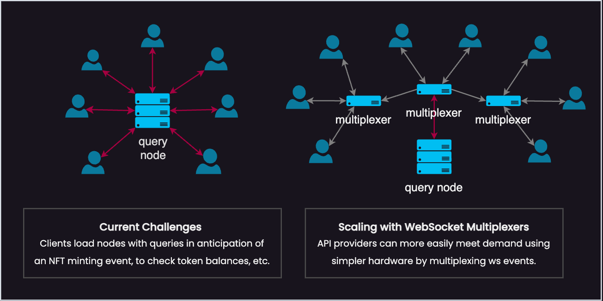

# Cosmos Power Stream

> TLDR; sits in-between Cosmos RPC node and clients, indexing all Tendermint/CometBFT events emitted by the node [over WebSocket](https://docs.cometbft.com/v0.38/core/subscription) and multiplexing WebSocket subscriptions between node and clients.

## Features
 - Reduces load on Cosmos node providers' RPC nodes and allows scaling out using simpler hardware
 - Search for transactions in recent history by querying the event attributes
 - Filter live events using advanced queries, e.g., `transfer.amount > 150uscrt AND message.module='compute'`
 - Infinitley scale by chaining multiple layers together (with or without indexing enabled)
 - Write, test, and visualize queries using the interactive front-end


### What?

Blockchains built on the Tendermint/CometBFT stack (i.e., Cosmos-SDK) have a powerful built-in feature on nodes' public-facing RPC ports, a real-time event stream at the `/websocket` endpoint behind the JSON-RPC `"subscribe"` method. It streams data to clients including about new blocks and committed transactions as they occur. These push events allow clients to receive information from the chain, including for transaction broadcast confirmations, much quicker and more efficiently than polling the node with queries.




## Quick Setup

```bash
# clone this repository
git clone https://github.com/SolarRepublic/cosmos-power-stream

# change directory
cd cosmos-power-stream

# launch the service set using Docker Compose
UPSTREAM_RPC_NODE="https://rpc.mainnet.secretsaturn.net" docker-compose up
```

Then, open a web browser to http://localhost:8080/ .


## Advanced Setup: Raw

Requires building each component from source and running locally.

#### Prepare the database

The database stores recently indexed transactions to allow clients to search for events back in time.

Start by initializing the database from the root directory of this repository with the npm script:

```bash
npm run init-db:postgres $CONNECTION_URL
```

Where `CONNECTION_URL` is a postgres connection URL such as `postgresql://user@localhost:5432/database`. Note that `database` is just where the user can connect, the command will create a new database named `cosmos_power_stream`.


## Advanced Setup: Docker Images

Check the docker-compose.yaml file for insight into how these services work together. The following section is for documenting each service more thoroughly for users who require more advanced setups.

#### Prepare the database

The database stores recently indexed transactions to allow clients to search for events back in time.

```bash
docker run -d \
	-p 5432:5432 \
	solar-republic/cosmos-power-stream-db-postgres
```


#### Run the service

The main service acts as a multiplexing relay, consuming events from the origin Tendermint/CometBFT WebSocket and replaying them to all subscribed clients. It also provides [additional functionality](#service-features) to clients.

```bash
docker run -d \
	-p 26659:26659 \
	-e UPSTREAM_RPC_NODE={UPSTREAM_RPC_NODE} \
	-e POSTGRES_HOST={POSTGRES_HOST} \
	-e POSTGRES_DATABASE={POSTGRES_DATABASE} \
	-e POSTGRES_USER={POSTGRES_USER} \
	-e POSTGRES_PASSWORD={POSTGRES_PASSWORD} \
	solar-republic/cosmos-power-stream-app \
	npm run host
```

If you running this on an RPC node, you can safely redirect to this service via reverse proxy for incoming requests to `/websocket`.


#### Run an indexer (optional)

Runs a node.js process that subscribes to events on the given WebSocket and indexes transactions into the configured Postgres database.

> NOTE: You will need to configure network access so that the docker container can reach the database.

```bash
docker run -d \
	-e UPSTREAM_RPC_NODE={UPSTREAM_RPC_NODE} \
	-e POSTGRES_HOST={POSTGRES_HOST} \
	-e POSTGRES_DATABASE={POSTGRES_DATABASE} \
	-e POSTGRES_USER={POSTGRES_USER} \
	-e POSTGRES_PASSWORD={POSTGRES_PASSWORD} \
	solar-republic/cosmos-power-stream-app \
	npm run index
```


#### Host the frontend

The frontend web application provides an interactive query building GUI and sandbox for developers to experiment with the service's features.

```bash
doker run -d 80:80 \
	solar-republic/cosmos-power-stream-ui
```


#### Building from source

```bash
./build-docker.sh
```

## Service Features


